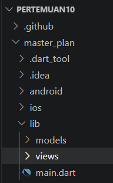
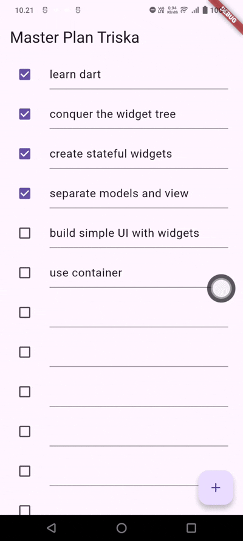
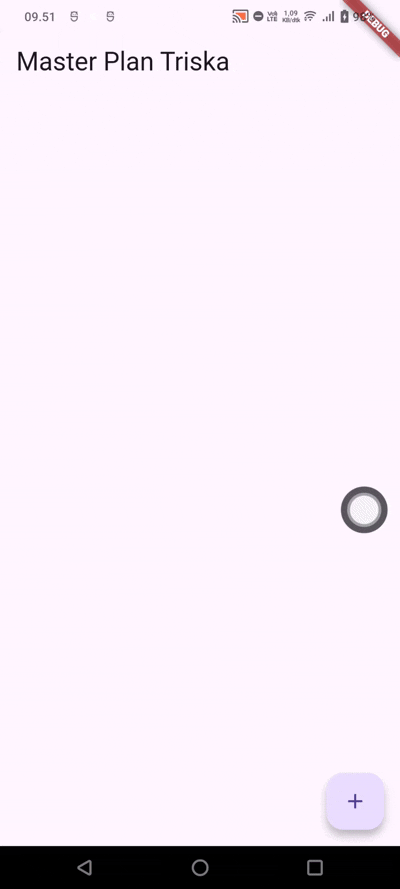
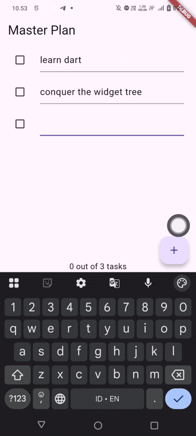
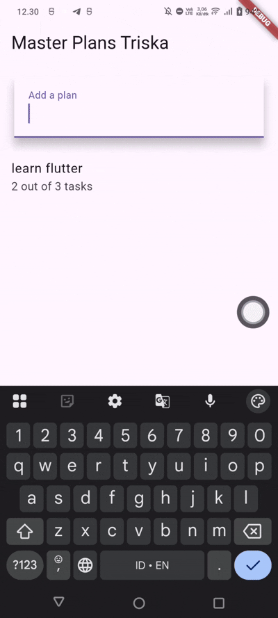

# Laporan Praktikum 10: Dasar State Management

Nama: Triskalimatu Sya'adah

NIM: 244107060025

Kelas: SIB 2D

# Praktikum 1: Dasar State dengan Model-View

## Langkah 1: Buat Project Baru



## Langkah 2: Membuat model task.dart

#### lib/models/task.dart

```dart
class Task {
  final String description;
  final bool complete;

  const Task({
    this.complete = false,
    this.description = '',
  });
}
```

## Langkah 3: Buat file plan.dart

#### lib/models/plan.dart

```dart
import './task.dart';

class Plan {
  final String name;
  final List<Task> tasks;

  const Plan({this.name = '', this.tasks = const []});
}
```

## Langkah 4: Buat file data_layer.dart

#### lib/models/data_layer.dart

```dart
export 'plan.dart';
export 'task.dart';
```

## Langkah 5: Pindah ke file main.dart

#### lib/main.dart

```dart
import 'package:flutter/material.dart';
import './views/plan_screen.dart';

void main() => runApp(MasterPlanApp());

class MasterPlanApp extends StatelessWidget {
  const MasterPlanApp({super.key});

  @override
  Widget build(BuildContext context) {
    return MaterialApp(
     theme: ThemeData(primarySwatch: Colors.purple),
     home: PlanScreen(),
    );
  }
}
```

## Langkah 6: buat plan_screen.dart

#### lib/views/plan_screen.dart

```dart
import '../models/data_layer.dart';
import 'package:flutter/material.dart';

class PlanScreen extends StatefulWidget {
  const PlanScreen({super.key});

  @override
  State createState() => _PlanScreenState();
}

class _PlanScreenState extends State<PlanScreen> {
  Plan plan = const Plan();

  @override
  Widget build(BuildContext context) {
   return Scaffold(
    // ganti ‘Namaku' dengan Nama panggilan Anda
    appBar: AppBar(title: const Text('Master Plan Triska')),
    body: _buildList(),
    floatingActionButton: _buildAddTaskButton(),
   );
  }
}
```

## Langkah 7: buat method \_buildAddTaskButton()

Menambahkan method Tambah Rencana, dengan menambahkan kode berikut di bawah method build di dalam class \_PlanScreenState.

```dart
Widget _buildAddTaskButton() {
  return FloatingActionButton(
   child: const Icon(Icons.add),
   onPressed: () {
     setState(() {
      plan = Plan(
       name: plan.name,
       tasks: List<Task>.from(plan.tasks)
       ..add(const Task()),
     );
    });
   },
  );
}
```

## Langkah 8: buat widget \_buildList()

Membuat widget berupa List yang dapat dilakukan scroll, yaitu ListView.builder

```dart
Widget _buildList() {
  return ListView.builder(
   itemCount: plan.tasks.length,
   itemBuilder: (context, index) =>
   _buildTaskTile(plan.tasks[index], index),
  );
}
```

## Langkah 9: buat widget \_buildTaskTile

```dart
 Widget _buildTaskTile(Task task, int index) {
    return ListTile(
      leading: Checkbox(
          value: task.complete,
          onChanged: (selected) {
            setState(() {
              plan = Plan(
                name: plan.name,
                tasks: List<Task>.from(plan.tasks)
                  ..[index] = Task(
                    description: task.description,
                    complete: selected ?? false,
                  ),
              );
            });
          }),
      title: TextFormField(
        initialValue: task.description,
        onChanged: (text) {
          setState(() {
            plan = Plan(
              name: plan.name,
              tasks: List<Task>.from(plan.tasks)
                ..[index] = Task(
                  description: text,
                  complete: task.complete,
                ),
            );
          });
        },
      ),
    );
  }
```

## Langkah 10: Tambah Scroll Controller

Tambahkan variabel scroll controller di class State tepat setelah variabel plan.

```dart
late ScrollController scrollController;
```

## Langkah 11: Tambah Scroll Listener

Tambahkan method initState() setelah deklarasi variabel scrollController seperti kode berikut.

```dart
@override
void initState() {
  super.initState();
  scrollController = ScrollController()
    ..addListener(() {
      FocusScope.of(context).requestFocus(FocusNode());
    });
}
```

## Langkah 12: Tambah controller dan keyboard behavior

Tambahkan controller dan keyboard behavior pada ListView di method \_buildList

```dart
return ListView.builder(
  controller: scrollController,
 keyboardDismissBehavior: Theme.of(context).platform ==
 TargetPlatform.iOS
          ? ScrollViewKeyboardDismissBehavior.onDrag
          : ScrollViewKeyboardDismissBehavior.manual,
```

## Langkah 13: Terakhir, tambah method dispose()

Tambahkan method dispose() berguna ketika widget sudah tidak digunakan lagi.

```dart
@override
void dispose() {
  scrollController.dispose();
  super.dispose();
}
```

## Langkah 14: Hasil



# Tugas Praktikum 1: Dasar State dengan Model-View

1. Selesaikan langkah-langkah praktikum tersebut, lalu dokumentasikan berupa GIF hasil akhir praktikum beserta penjelasannya di file README.md! Jika Anda menemukan ada yang error atau tidak berjalan dengan baik, silakan diperbaiki.
2. Jelaskan maksud dari langkah 4 pada praktikum tersebut! Mengapa dilakukan demikian?

#### jawab:

```dart
export 'plan.dart';
export 'task.dart';
```

Langkah ini digunakan untuk membuat file penggabung (barrel file) yang menyatukan beberapa model (Plan dan Task) dalam satu file untuk mempermudah proses import di file lain

3. Mengapa perlu variabel plan di langkah 6 pada praktikum tersebut? Mengapa dibuat konstanta ?

#### jawab:

```dart
Plan plan = const Plan();
```

Variabel plan digunakan untuk menyimpan dan mengelola seluruh data task pada aplikasi. Variabel ini menjadi sumber data yang ditampilkan dan diperbarui saat terjadi perubahan.

const digunakan karena object Plan awal dibuat dalam kondisi tetap (kosong) dan agar lebih efisien serta mendukung konsep immutable pada Flutter.

4. Lakukan capture hasil dari Langkah 9 berupa GIF, kemudian jelaskan apa yang telah Anda buat!

#### jawab:



Pada langkah 9 dibuat widget \_buildTaskTile() yang berfungsi untuk menampilkan setiap task secara dinamis menggunakan ListTile. Widget ini terdiri dari Checkbox untuk menandai status task dan TextFormField untuk mengisi atau mengubah deskripsi task. Data ditampilkan berdasarkan index dari plan.tasks, sehingga setiap perubahan dapat langsung diperbarui pada tampilan menggunakan setState().

5. Apa kegunaan method pada Langkah 11 dan 13 dalam lifecyle state ?

#### jawab:

Method initState() pada langkah 11 digunakan untuk melakukan inisialisasi ScrollController dan menambahkan listener saat widget pertama kali dibuat, sedangkan method dispose() pada langkah 13 digunakan untuk membersihkan ScrollController ketika widget sudah tidak digunakan lagi agar tidak terjadi memory leak.

6. Kumpulkan laporan praktikum Anda berupa link commit atau repository GitHub ke dosen yang telah disepakati !

# Praktikum 2: Mengelola Data Layer dengan InheritedWidget dan InheritedNotifier

## Langkah 1: Buat file plan_provider.dart

#### lib/provider.plan_provider.dart

```dart
import 'package:flutter/material.dart';
import '../models/data_layer.dart';

class PlanProvider extends InheritedNotifier<ValueNotifier<Plan>> {
  const PlanProvider({super.key, required Widget child, required
   ValueNotifier<Plan> notifier})
  : super(child: child, notifier: notifier);

  static ValueNotifier<Plan> of(BuildContext context) {
   return context.
    dependOnInheritedWidgetOfExactType<PlanProvider>()!.notifier!;
  }
}
```

## Langkah 2: Edit main.dart

Gantilah pada bagian atribut home dengan PlanProvider seperti berikut.

```dart
return MaterialApp(
  theme: ThemeData(primarySwatch: Colors.purple),
  home: PlanProvider(
    notifier: ValueNotifier<Plan>(const Plan()),
    child: const PlanScreen(),
   ),
);
```

## Langkah 3: Tambah method pada model plan.dart

Tambahkan dua method di dalam model class Plan

```dart
int get completedCount => tasks
  .where((task) => task.complete)
  .length;

String get completenessMessage =>
  '$completedCount out of ${tasks.length} tasks';
```

## Langkah 4: Pindah ke PlanScreen

Edit PlanScreen agar menggunakan data dari PlanProvider. Hapus deklarasi variabel plan

```dart
Plan plan = const Plan();
```

## Langkah 5: Edit method \_buildAddTaskButton

Tambahkan BuildContext sebagai parameter dan gunakan PlanProvider sebagai sumber datanya.

```dart
Widget _buildAddTaskButton(BuildContext context) {
  ValueNotifier<Plan> planNotifier = PlanProvider.of(context);
  return FloatingActionButton(
    child: const Icon(Icons.add),
    onPressed: () {
      Plan currentPlan = planNotifier.value;
      planNotifier.value = Plan(
        name: currentPlan.name,
        tasks: List<Task>.from(currentPlan.tasks)..add(const Task()),
      );
    },
  );
}

```

## Langkah 6: Edit method \_buildTaskTile

Tambahkan parameter BuildContext, gunakan PlanProvider sebagai sumber data. Ganti TextField menjadi TextFormField untuk membuat inisial data provider menjadi lebih mudah.

```dart
Widget _buildTaskTile(Task task, int index, BuildContext context) {
  ValueNotifier<Plan> planNotifier = PlanProvider.of(context);
  return ListTile(
    leading: Checkbox(
       value: task.complete,
       onChanged: (selected) {
         Plan currentPlan = planNotifier.value;
         planNotifier.value = Plan(
           name: currentPlan.name,
           tasks: List<Task>.from(currentPlan.tasks)
             ..[index] = Task(
               description: task.description,
               complete: selected ?? false,
             ),
         );
       }),
    title: TextFormField(
      initialValue: task.description,
      onChanged: (text) {
        Plan currentPlan = planNotifier.value;
        planNotifier.value = Plan(
          name: currentPlan.name,
          tasks: List<Task>.from(currentPlan.tasks)
            ..[index] = Task(
              description: text,
              complete: task.complete,
            ),
        );
      },
    ),
  );
}
```

## Langkah 7: Edit \_buildList

```dart
Widget _buildList(Plan plan) {
   return ListView.builder(
     controller: scrollController,
     itemCount: plan.tasks.length,
     itemBuilder: (context, index) =>
        _buildTaskTile(plan.tasks[index], index, context),
   );
}
```

## Langkah 8: Tetap di class PlanScreen

```dart
 @override
  Widget build(BuildContext context) {
    return Scaffold(
      appBar: AppBar(
        title: const Text('Master Plan Triska'),
      ),
      body: ValueListenableBuilder<Plan>(
        valueListenable: PlanProvider.of(context),
        builder: (context, plan, child) {
          return Column(
            children: [
              Expanded(
                child: _buildList(plan),
              ),
            ],
          );
        },
      ),
      floatingActionButton: _buildAddTaskButton(context),
    );
  }
```

## Langkah 9: Tambah widget SafeArea

Tambahkan widget SafeArea dengan berisi completenessMessage pada akhir widget Column.

```dart
@override
Widget build(BuildContext context) {
   return Scaffold(
     appBar: AppBar(title: const Text('Master Plan')),
     body: ValueListenableBuilder<Plan>(
       valueListenable: PlanProvider.of(context),
       builder: (context, plan, child) {
         return Column(
           children: [
             Expanded(child: _buildList(plan)),
             SafeArea(child: Text(plan.completenessMessage))
           ],
         );
       },
     ),
     floatingActionButton: _buildAddTaskButton(context),
   );
}
```

# Tugas Praktikum 2: InheritedWidget

1. Selesaikan langkah-langkah praktikum tersebut, lalu dokumentasikan berupa GIF hasil akhir praktikum beserta penjelasannya di file README.md! Jika Anda menemukan ada yang error atau tidak berjalan dengan baik, silakan diperbaiki sesuai dengan tujuan aplikasi tersebut dibuat.
2. Jelaskan mana yang dimaksud InheritedWidget pada langkah 1 tersebut! Mengapa yang digunakan InheritedNotifier?

#### jawab:

Pada langkah 1, yang dimaksud InheritedWidget adalah konsep dasarnya dari class PlanProvider yang diturunkan dari:

```dart
InheritedNotifier<ValueNotifier<Plan>>
```

PlanProvider merupakan bentuk pengembangan dari InheritedWidget yang digunakan untuk membagikan data (Plan) ke seluruh widget di dalam widget tree tanpa harus dikirim manual melalui constructor.

InheritedNotifier dipilih karena lebih praktis dan mendukung update UI otomatis saat data Plan berubah.

3. Jelaskan maksud dari method di langkah 3 pada praktikum tersebut! Mengapa dilakukan demikian?

#### jawab:

Pada langkah 3 ditambahkan dua method di dalam class Plan, yaitu:

```dart
int get completedCount => tasks
  .where((task) => task.complete)
  .length;

String get completenessMessage =>
  '$completedCount out of ${tasks.length} tasks';
```

completedCount digunakan untuk menghitung jumlah task yang sudah selesai (dicentang).
completenessMessage digunakan untuk menampilkan progress task dalam bentuk teks seperti “1 out of 3 tasks”.
Method ini dibuat agar aplikasi dapat menampilkan progres pekerjaan secara otomatis tanpa harus menghitung manual di UI

4. Lakukan capture hasil dari Langkah 9 berupa GIF, kemudian jelaskan apa yang telah Anda buat!

#### jawab:



Pada langkah 9 dibuat tampilan akhir aplikasi yang menampilkan daftar task menggunakan ListView, dengan fitur interaktif berupa Checkbox untuk menandai task selesai dan TextFormField untuk mengisi atau mengubah deskripsi task.
Saat aplikasi dijalankan, user dapat menambahkan task baru, mengedit isi task, dan mencentang task yang sudah selesai. Setiap perubahan akan langsung memperbarui tampilan secara otomatis menggunakan ValueListenableBuilder. Selain itu, di bagian bawah layar ditampilkan progress task dalam bentuk teks seperti “x out of y tasks” menggunakan completenessMessage.

5. Kumpulkan laporan praktikum Anda berupa link commit atau repository GitHub ke dosen yang telah disepakati !

# Praktikum 3: Membuat State di Multiple Screens

## Langkah 1: Edit PlanProvider

#### lib/provider/plan_provider.dart

```dart
class PlanProvider extends InheritedNotifier<ValueNotifier<List<Plan>>> {
  const PlanProvider({
    super.key,
    required Widget child,
    required ValueNotifier<List<Plan>> notifier,
  }) : super(child: child, notifier: notifier);

  static ValueNotifier<List<Plan>> of(BuildContext context) {
    return context
        .dependOnInheritedWidgetOfExactType<PlanProvider>()!
        .notifier!;
  }
}
```

## Langkah 2: Edit main.dart

#### lib/views/plan_screen.dart

```dart
@override
Widget build(BuildContext context) {
  return PlanProvider(
    notifier: ValueNotifier<List<Plan>>(const []),
    child: MaterialApp(
      title: 'State management app',
      theme: ThemeData(
        primarySwatch: Colors.blue,
      ),
      home: const PlanScreen(),
    ),
  );
}
```

## Langkah 3: Edit plan_screen.dart

Tambahkan variabel plan dan atribut pada constructor-nya

```dart
final Plan plan;
const PlanScreen({super.key, required this.plan});
```

## Langkah 4: Error

Itu akan terjadi error setiap kali memanggil PlanProvider.of(context). Itu terjadi karena screen saat ini hanya menerima tugas-tugas untuk satu kelompok Plan, tapi sekarang PlanProvider menjadi list dari objek plan tersebut.

## Langkah 5: Tambah getter Plan

Tambahkan getter pada \_PlanScreenState

```dart
class _PlanScreenState extends State<PlanScreen> {
  late ScrollController scrollController;
  Plan get plan => widget.plan;
```

## Langkah 6: Method initState()

```dart
@override
void initState() {
   super.initState();
   scrollController = ScrollController()
    ..addListener(() {
      FocusScope.of(context).requestFocus(FocusNode());
    });
}
```

## Langkah 7: Widget build

Pastikan telah merubah ke List dan mengubah nilai pada currentPlan

```dart
@override
Widget build(BuildContext context) {
  ValueNotifier<List<Plan>> plansNotifier =
      PlanProvider.of(context);

  return Scaffold(
    appBar: AppBar(
      title: Text(plan.name),
    ),
    body: ValueListenableBuilder<List<Plan>>(
      valueListenable: plansNotifier,
      builder: (context, plans, child) {
        Plan currentPlan = plans.firstWhere(
          (p) => p.name == plan.name,
        );

        return Column(
          children: [
            Expanded(
              child: _buildList(currentPlan),
            ),
            SafeArea(
              child: Text(currentPlan.completenessMessage),
            ),
          ],
        );
      },
    ),
    floatingActionButton: _buildAddTaskButton(context),
  );
}

Widget _buildAddTaskButton(BuildContext context) {
  ValueNotifier<List<Plan>> planNotifier =
      PlanProvider.of(context);

  return FloatingActionButton(
    child: const Icon(Icons.add),
    onPressed: () {
      Plan currentPlan = plan;

      int planIndex = planNotifier.value.indexWhere(
        (p) => p.name == currentPlan.name,
      );

      List<Task> updatedTasks =
          List<Task>.from(currentPlan.tasks)
            ..add(const Task());

      planNotifier.value = List<Plan>.from(planNotifier.value)
        ..[planIndex] = Plan(
          name: currentPlan.name,
          tasks: updatedTasks,
        );
    },
  );
}
```

## Langkah 8: Edit \_buildTaskTile

Pastikan ubah ke List dan variabel planNotifier

```dart
Widget _buildTaskTile(
  Task task,
  int index,
  BuildContext context,
) {
  ValueNotifier<List<Plan>> planNotifier =
      PlanProvider.of(context);

  return ListTile(
    leading: Checkbox(
      value: task.complete,
      onChanged: (selected) {
        Plan currentPlan = plan;

        int planIndex = planNotifier.value.indexWhere(
          (p) => p.name == currentPlan.name,
        );

        planNotifier.value = List<Plan>.from(planNotifier.value)
          ..[planIndex] = Plan(
            name: currentPlan.name,
            tasks: List<Task>.from(currentPlan.tasks)
              ..[index] = Task(
                description: task.description,
                complete: selected ?? false,
              ),
          );
      },
    ),
    title: TextFormField(
      initialValue: task.description,
      onChanged: (text) {
        Plan currentPlan = plan;

        int planIndex = planNotifier.value.indexWhere(
          (p) => p.name == currentPlan.name,
        );

        planNotifier.value = List<Plan>.from(planNotifier.value)
          ..[planIndex] = Plan(
            name: currentPlan.name,
            tasks: List<Task>.from(currentPlan.tasks)
              ..[index] = Task(
                description: text,
                complete: task.complete,
              ),
          );
      },
    ),
  );
}
```

## Langkah 9: Buat screen baru

Pada folder view, buatlah file baru dengan nama plan_creator_screen.dart dan deklarasikan dengan StatefulWidget bernama PlanCreatorScreen.

#### lib/views/plan_creator_screen.dart

```dart
import 'package:flutter/material.dart';
import '../models/data_layer.dart';
import '../provider/plan_provider.dart';
import 'plan_screen.dart';

class PlanCreatorScreen extends StatefulWidget {
  const PlanCreatorScreen({super.key});

  @override
  State<PlanCreatorScreen> createState() =>
      _PlanCreatorScreenState();
}

class _PlanCreatorScreenState
    extends State<PlanCreatorScreen> {
  final TextEditingController textController =
      TextEditingController();

  @override
  void dispose() {
    textController.dispose();
    super.dispose();
  }

  @override
  Widget build(BuildContext context) {
    return Scaffold(
      appBar: AppBar(
        title: const Text('Master Plans'),
      ),
      body: Column(
        children: [
          _buildListCreator(),
          Expanded(child: _buildMasterPlans()),
        ],
      ),
    );
  }

  // INPUT PLAN BARU
  Widget _buildListCreator() {
    return Padding(
      padding: const EdgeInsets.all(20.0),
      child: Material(
        color: Theme.of(context).cardColor,
        elevation: 10,
        child: TextField(
          controller: textController,
          decoration: const InputDecoration(
            labelText: 'Add a plan',
            contentPadding: EdgeInsets.all(20),
          ),
          onEditingComplete: addPlan,
        ),
      ),
    );
  }

  // TAMBAH PLAN
  void addPlan() {
    final text = textController.text;

    if (text.isEmpty) return;

    final plan = Plan(name: text, tasks: []);

    ValueNotifier<List<Plan>> planNotifier =
        PlanProvider.of(context);

    planNotifier.value =
        List<Plan>.from(planNotifier.value)..add(plan);

    textController.clear();
    FocusScope.of(context).requestFocus(FocusNode());
    setState(() {});
  }

  // LIST SEMUA PLAN
  Widget _buildMasterPlans() {
    ValueNotifier<List<Plan>> planNotifier =
        PlanProvider.of(context);

    List<Plan> plans = planNotifier.value;

    if (plans.isEmpty) {
      return const Column(
        mainAxisAlignment: MainAxisAlignment.center,
        children: [
          Icon(Icons.note, size: 100, color: Colors.grey),
          SizedBox(height: 10),
          Text('Anda belum memiliki rencana apapun.'),
        ],
      );
    }

    return ListView.builder(
      itemCount: plans.length,
      itemBuilder: (context, index) {
        final plan = plans[index];

        return ListTile(
          title: Text(plan.name),
          subtitle: Text(plan.completenessMessage),
          onTap: () {
            Navigator.of(context).push(
              MaterialPageRoute(
                builder: (_) =>
                    PlanScreen(plan: plan),
              ),
            );
          },
        );
      },
    );
  }
}
```

#### lib/mian.dart

Gantilah di main.dart pada atribut home menjadi seperti berikut.

```dart
home: const PlanCreatorScreen(),
```

## Langkah 10: Pindah ke class \_PlanCreatorScreenState

Tambahkan variabel TextEditingController sehingga bisa membuat TextField sederhana untuk menambah Plan baru. Jangan lupa tambahkan dispose ketika widget unmounte

```dart
final textController = TextEditingController();

@override
void dispose() {
  textController.dispose();
  super.dispose();
}
```

## Langkah 11: Pindah ke method build

Letakkan method Widget build berikut di atas void dispose.

```dart
@override
Widget build(BuildContext context) {
  return Scaffold(
    appBar: AppBar(title: const Text('Master Plans Triska')),
    body: Column(children: [
      _buildListCreator(),
      Expanded(child: _buildMasterPlans())
    ]),
  );
}
```

## Langkah 12: Buat widget \_buildListCreator

```dart
Widget _buildListCreator() {
  return Padding(
     padding: const EdgeInsets.all(20.0),
     child: Material(
       color: Theme.of(context).cardColor,
       elevation: 10,
       child: TextField(
          controller: textController,
          decoration: const InputDecoration(
             labelText: 'Add a plan',
             contentPadding: EdgeInsets.all(20)),
          onEditingComplete: addPlan),
     ));
}
```

## Langkah 13: Buat void addPlan()

Tambahkan method berikut untuk menerima inputan dari user berupa text plan.

```dart
void addPlan() {
    final text = textController.text;

    if (text.isEmpty) return;

    final plan = Plan(name: text, tasks: []);

    ValueNotifier<List<Plan>> planNotifier = PlanProvider.of(context);

    planNotifier.value = List<Plan>.from(planNotifier.value)..add(plan);

    textController.clear();
    FocusScope.of(context).requestFocus(FocusNode());

    setState(() {});
  }
```

## Langkah 14: Buat widget \_buildMasterPlans()

```dart
  Widget _buildMasterPlans() {
    ValueNotifier<List<Plan>> planNotifier = PlanProvider.of(context);
    List<Plan> plans = planNotifier.value;

    if (plans.isEmpty) {
      return const Column(
        mainAxisAlignment: MainAxisAlignment.center,
        children: [
          Icon(Icons.note, size: 100, color: Colors.grey),
          SizedBox(height: 10),
          Text('Anda belum memiliki rencana apapun.'),
        ],
      );
    }

    return ListView.builder(
      itemCount: plans.length,
      itemBuilder: (context, index) {
        final plan = plans[index];

        return ListTile(
          title: Text(plan.name),
          subtitle: Text(plan.completenessMessage),
          onTap: () {
            Navigator.of(
              context,
            ).push(MaterialPageRoute(builder: (_) => PlanScreen(plan: plan)));
          },
        );
      },
    );
  }
}
```

# Tugas Praktikum 3: State di Multiple Screens

1. Selesaikan langkah-langkah praktikum tersebut, lalu dokumentasikan berupa GIF hasil akhir praktikum beserta penjelasannya di file README.md! Jika Anda menemukan ada yang error atau tidak berjalan dengan baik, silakan diperbaiki sesuai dengan tujuan aplikasi tersebut dibuat.
2. Berdasarkan Praktikum 3 yang telah Anda lakukan, jelaskan maksud dari gambar diagram berikut ini!


#### jawab:

Diagram tersebut menunjukkan struktur widget dan alur navigasi pada aplikasi Flutter di Praktikum 3. Bagian kiri merupakan halaman awal yaitu PlanCreatorScreen yang berisi TextField untuk input data dan ListView untuk menampilkan daftar plan dalam susunan Column. Setelah pengguna melakukan aksi tertentu, aplikasi berpindah ke halaman PlanScreen menggunakan Navigator.push. Pada halaman tujuan terdapat Scaffold, SafeArea, Column, ListView, dan Text yang digunakan untuk menampilkan isi data plan dengan tampilan yang lebih aman dan terstruktur. Selain itu, PlanProvider digunakan untuk mengelola data agar dapat diakses antar halaman.

3. Lakukan capture hasil dari Langkah 14 berupa GIF, kemudian jelaskan apa yang telah Anda buat!

#### jawab:



Pada langkah 14, dibuat widget \_buildMasterPlans() yang berfungsi untuk menampilkan daftar seluruh plan yang telah dibuat oleh pengguna. Widget ini mengambil data plan dari PlanProvider menggunakan ValueNotifier. Jika belum ada data plan, aplikasi akan menampilkan ikon catatan dan pesan “Anda belum memiliki rencana apapun”. Namun jika data tersedia, aplikasi akan menampilkan daftar plan menggunakan ListView.builder. Setiap item ditampilkan dalam bentuk ListTile yang berisi nama plan dan tingkat kelengkapannya. Selain itu, ketika salah satu plan dipilih, aplikasi akan berpindah ke halaman PlanScreen menggunakan Navigator.push untuk menampilkan detail plan tersebut.

4. Kumpulkan laporan praktikum Anda berupa link commit atau repository GitHub ke dosen yang telah disepakati !
