# Laporan Praktikum 11: Pemrograman Asynchronous

Nama: Triskalimatu Sya'adah

NIM: 244107060025

Kelas: SIB 2D

# Praktikum 1: Mengunduh Data dari Web Service (API)

## Langkah 1: Buat Project Baru

Buat prject baru dengan nama **books**. Kemudian Tambahkan dependensi http

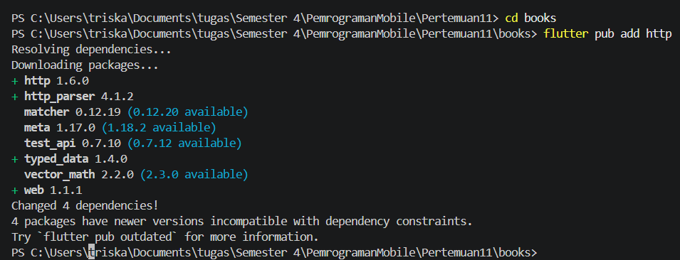

## Langkah 2: Cek file pubspec.yaml

Pastikan plugin http telah ada di file pubspec

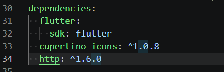

## Langkah 3: Buka file main.dart

```dart
import 'dart:async';
import 'package:flutter/material.dart';
import 'package:http/http.dart';
import 'package:http/http.dart' as http;

void main() {
  runApp(const MyApp());
}

class MyApp extends StatelessWidget {
  const MyApp({super.key});

  @override
  Widget build(BuildContext context) {
    return MaterialApp(
      title: 'Future Demo - Triska',
      theme: ThemeData(
        primarySwatch: Colors.blue,
        visualDensity: VisualDensity.adaptivePlatformDensity,
      ),
      home: const FuturePage(),
    );
  }
}

class FuturePage extends StatefulWidget {
  const FuturePage({super.key});

  @override
  State<FuturePage> createState() => _FuturePageState();
}
  @override
  Widget build(BuildContext context) {
    return Scaffold(
      appBar: AppBar(title: const Text('Back from the Future - Triska')),
      body: Center(
        child: Column(
          children: [
            const Spacer(),
            ElevatedButton(
              child: const Text('GO!'),
              onPressed: () {
                getData()
                    .then((value) {
                      setState(() {
                        result = value.body.toString().substring(0, 450);
                      });
                    })
                    .catchError((error) {
                      setState(() {
                        result = 'An error occurred';
                      });
                    });
              },
            ),

            const Spacer(),
            Text(result),
            const Spacer(),
            const CircularProgressIndicator(),
            const Spacer(),
          ],
        ),
      ),
    );
  }
```

### Soal 1

Tambahkan nama panggilan Anda pada title app

```dart
return MaterialApp(
      title: 'Future Demo - Triska',
      ...
      );
```

```dart
 @override
  Widget build(BuildContext context) {
    return Scaffold(
      appBar: AppBar(title: const Text('Back from the Future - Triska')),
    ...
    )
  }
```

## Langkah 4: Tambah method getData()

Tambahkan method ini ke dalam class \_FuturePageState yang berguna untuk mengambil data dari API Google Books.

```dart
class _FuturePageState extends State<FuturePage> {
  String result = '';
  Future<Response> getData() async {
    const authority = 'www.googleapis.com';
    const path = '/books/v1/volumes/junbDwAAQBAJ';
    Uri url = Uri.https(authority, path);
    return http.get(url);
  }
```

### Soal 2

Carilah judul buku favorit Anda di Google Books, lalu ganti ID buku pada variabel path di kode tersebut.

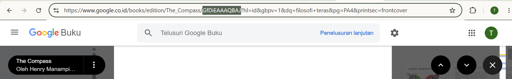

Menampilkan data JSON pada browser


## Langkah 5: Tambah kode di ElevatedButton

Tambahkan kode pada onPressed di ElevatedButton

```dart
@override
  Widget build(BuildContext context) {
    return Scaffold(
      appBar: AppBar(title: const Text('Back from the Future - Triska')),
      body: Center(
        child: Column(
          children: [
            const Spacer(),
            ElevatedButton(
              child: const Text('GO!'),
              onPressed: () {
                setState(() {});
                getData()
                    .then((value) {
                      setState(() {
                        result = value.body.toString().substring(0, 450);
                      });
                    })
                    .catchError((error) {
                      result = 'An error occurred';
                      setState(() {});
                    });
              },
            ),
            ...
          ],
        ),
      ),
    );
  }
}
```

### Soal 3

- Jelaskan maksud kode langkah 5 tersebut terkait substring dan catchError!

#### jawab:

substring(0, 450) digunakan untuk membatasi jumlah karakter yang ditampilkan dari hasil response API agar tidak terlalu panjang di UI.
catchError() digunakan untuk menangani error pada proses asynchronous sehingga aplikasi tetap berjalan meskipun terjadi kegagalan saat mengambil data dari API.

- Hasil praktikum:

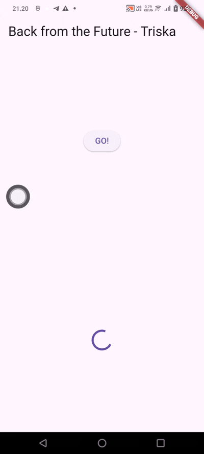

# Praktikum 2: Menggunakan await/async untuk menghindari callbacks

## Langkah 1: Buka file main.dart

Tambahkan tiga method berisi kode seperti berikut di dalam class \_FuturePageState.

```dart
Future<int> returnOneAsync() async {
  await Future.delayed(const Duration(seconds: 3));
  return 1;
}

Future<int> returnTwoAsync() async {
  await Future.delayed(const Duration(seconds: 3));
  return 2;
}

Future<int> returnThreeAsync() async {
  await Future.delayed(const Duration(seconds: 3));
  return 3;
}
```

## Langkah 2: Tambah method count()

Lalu tambahkan lagi method ini di bawah ketiga method sebelumnya.

```dart
Future count() async {
  int total = 0;
  total = await returnOneAsync();
  total += await returnTwoAsync();
  total += await returnThreeAsync();
  setState(() {
    result = total.toString();
  });
}
```

## Langkah 3: Panggil count()

Lakukan comment kode sebelumnya, ubah isi kode onPressed()

```dart
ElevatedButton(
  child: Text('GO!'),
    onPressed: () {
      count();
    },
)
...
```

## Langkah 4: Run

Hasil angka 6 akan tampil setelah delay 9 detik.

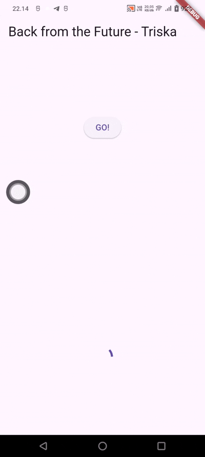

### Soal 4

- Jelaskan maksud kode langkah 1 dan 2 tersebut!

#### jawab:

Langkah 1 berisi tiga method asynchronous yang masing-masing mengembalikan nilai integer (1, 2, dan 3). Setiap method menggunakan Future.delayed selama 3 detik sebelum mengembalikan hasil, sehingga proses tidak langsung selesai tetapi membutuhkan waktu tunggu.
Langkah 2 berisi method count() yang memanggil ketiga method pada langkah 1 secara berurutan menggunakan await. Hasil dari setiap method dijumlahkan menjadi satu variabel total, yaitu 1 + 2 + 3 = 6. Setelah proses selesai, nilai tersebut ditampilkan ke layar menggunakan setState.

- Hasil praktikum:


# Praktikum 3: Menggunakan Completer di Future

## Langkah 1: Buka main.dart

impor package async

```dart
import 'package:async/async.dart';
```

## Langkah 2: Tambahkan variabel dan method

Tambahkan variabel late dan method di class \_FuturePageState

```dart
late Completer completer;

Future getNumber() {
  completer = Completer<int>();
  calculate();
  return completer.future;
}

Future calculate() async {
  await Future.delayed(const Duration(seconds : 5));
  completer.complete(42);
}
```

## Langkah 3: Ganti isi kode onPressed()

Tambahkan kode berikut pada fungsi onPressed().

```dart
getNumber().then((value) {
                setState(() {
                  result = value.toString();
                });
              });
```

## Langkah 4: Run

Hasilnyan setelah 5 detik, maka angka 42 akan tampil.

### Soal 5

- Jelaskan maksud kode langkah 2 tersebut

#### jawab:

Langkah 2 menggunakan Completer untuk mengatur proses asynchronous secara manual. Method getNumber() membuat objek Completer<int> lalu memanggil calculate() yang menunda eksekusi selama 5 detik.

Setelah itu, completer.complete(42) digunakan untuk menyelesaikan Future dan mengirimkan nilai 42 sebagai hasil. Dengan cara ini, kita bisa menentukan sendiri kapan proses asynchronous selesai dan nilai dikembalikan.

- Capture hasil praktikum Anda berupa GIF

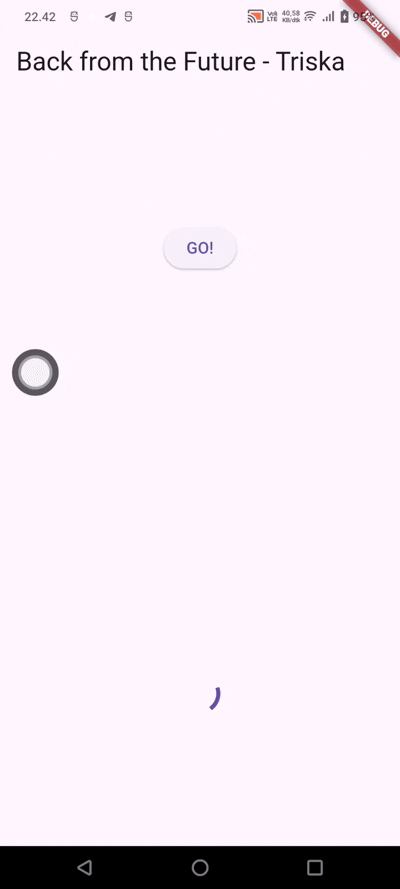

## Langkah 5: Ganti method calculate()

Ganti isi code method calculate() seperti kode berikut, atau dapat membuat calculate2()

```dart
Future calculate() async {
  try {
    await Future.delayed(const Duration(seconds: 5));
    completer.complete(42);
    // throw Exception();
  } catch (_) {
    completer.completeError({});
  }
}
```

## Langkah 6: Pindah ke onPressed()

```dart
onPressed: () {
  getNumber().then((value) {
    setState(() {
      result = value.toString();
    });
  }).catchError((e) {
    setState(() {
      result = 'An error occurred';
    });
  });
},
```

### Soal 6

- Jelaskan maksud perbedaan kode langkah 2 dengan langkah 5-6 tersebut!

#### jawab:

Langkah 2 menggunakan Completer secara sederhana untuk menghasilkan nilai 42 setelah delay 5 detik tanpa penanganan error, sehingga alurnya hanya sukses saja.

Sedangkan langkah 5–6 menambahkan try-catch dan catchError untuk menangani dua kondisi, yaitu sukses (mengembalikan 42) dan gagal (mengirim error). Jadi, versi ini lebih lengkap karena bisa menangani kegagalan proses asynchronous.

- Capture hasil praktikum Anda berupa GIF

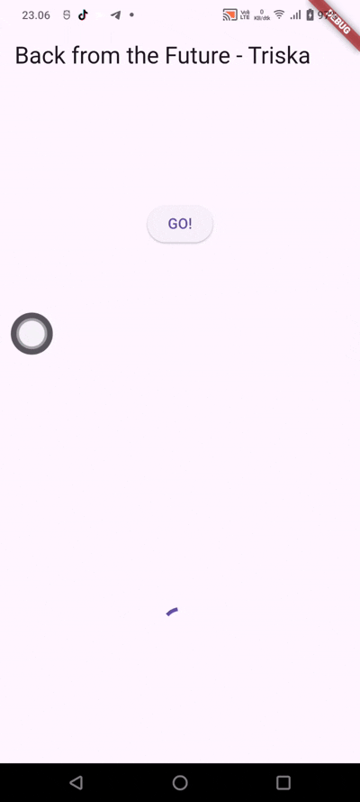

# Praktikum 4: Memanggil Future secara paralel

## Langkah 1: Buka file main.dart

Tambahkan method ini ke dalam class \_FuturePageState

```dart
void returnFG() {
  FutureGroup<int> futureGroup = FutureGroup<int>();

  futureGroup.add(returnOneAsync());
  futureGroup.add(returnTwoAsync());
  futureGroup.add(returnThreeAsync());

  futureGroup.close();

  futureGroup.future.then((List<int> value) {
    int total = 0;

    for (var element in value) {
      total += element;
    }

    setState(() {
      result = total.toString();
    });
  });
}
```

## Langkah 2: Edit onPressed()

hapus code onPressed sebelumnya, ganti menjadi:

```dart
onPressed: () {
  returnFG();
},
```

## Langkah 3: Run

### soal 7

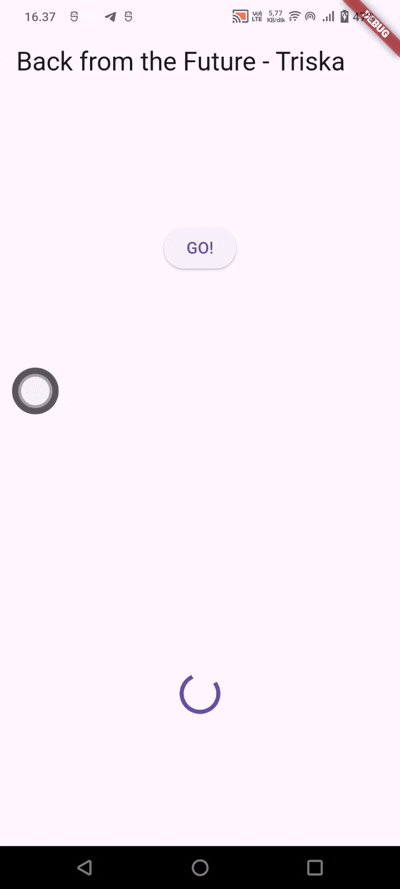

## Langkah 4: Ganti variabel futureGroup

Menggunakan FutureGroup dengan Future.wait

```dart
void returnFG() {
    final futures = Future.wait<int>([
      returnOneAsync(),
      returnTwoAsync(),
      returnThreeAsync(),
    ]);
  ...
}
```

### soal 8

Jelaskan maksud perbedaan kode langkah 1 dan 4!

#### jawab:

perbedaanya terletak pada cara mengelola beberapa proses asynchronous yang dijalankan secara bersamaan.
Pada langkah 1 digunakan FutureGroup, yaitu class dari package async yang berfungsi mengelompokkan beberapa Future. Setiap Future harus ditambahkan satu per satu menggunakan add(), lalu ditutup dengan close() agar proses dapat dijalankan dan hasilnya dikumpulkan.
Sedangkan pada langkah 4 digunakan Future.wait, yaitu fitur bawaan Dart yang lebih sederhana untuk menjalankan beberapa Future secara paralel. Semua Future langsung dimasukkan ke dalam sebuah list sehingga kode menjadi lebih ringkas dan mudah dibaca tanpa perlu menggunakan add() dan close().

# Praktikum 5: Menangani Respon Error pada Async Code

## Langkah 1: Buka file main.dart

Tambahkan method ini ke dalam class \_FuturePageState

```dart
ElevatedButton(
  child: const Text('GO!'),
    onPressed: () {
      returnError()
        .then((value) {
          setState(() {
            result = 'Success';
          });
        })
          .catchError((onError) {
          setState(() {
            result = onError.toString();
          });
        })
          .whenComplete(() => print('Complete'));
        },
      ),
```

## Langkah 3: Run

### Soal 9

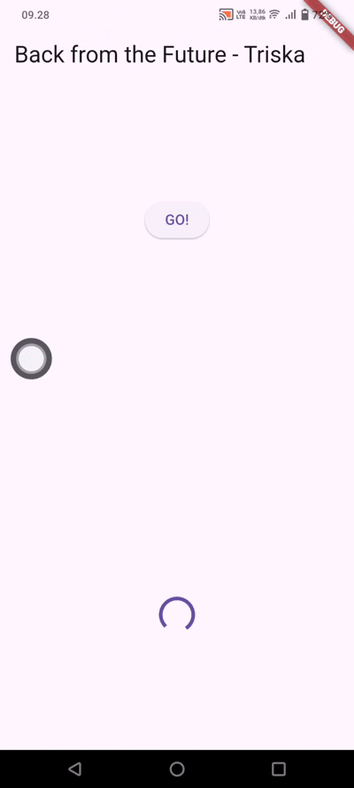

## Langkah 4: Tambah method handleError()

```dart
Future handleError() async {
    try {
      await returnError();

      setState(() {
        result = 'Success';
      });
    } catch (error) {
      setState(() {
        result = error.toString();
      });
    } finally {
      print('Complete');
    }
  }
```

### soal 10

Panggil method handleError() tersebut di ElevatedButton, lalu run. Apa hasilnya? Jelaskan perbedaan kode langkah 1 dan 4!

#### jawab:

Saat method handleError() dipanggil melalui tombol GO!, program akan menjalankan returnError(), yang setelah 2 detik menghasilkan exception "Something terrible happened!". Error tersebut ditangkap oleh blok catch sehingga pesan error ditampilkan pada layar, dan blok finally tetap dijalankan untuk mencetak "Complete" ke console.
Perbedaan antara langkah 1 dan langkah 4 adalah langkah 1 menggunakan metode .then(), .catchError(), dan .whenComplete() untuk menangani hasil Future, sedangkan langkah 4 menggunakan async-await dengan try-catch-finally. Keduanya menghasilkan output yang sama, tetapi kode pada langkah 4 lebih rapi,

output:

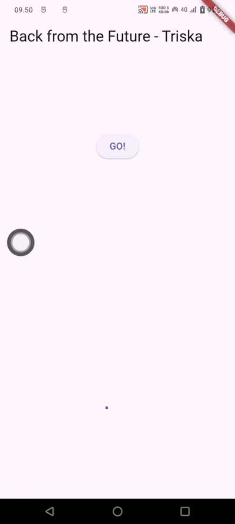

# Praktikum 6: Menggunakan Future dengan StatefulWidget

## Langkah 1: install plugin geolocator

Tambahkan plugin geolocator

```dart
flutter pub add geolocator
```

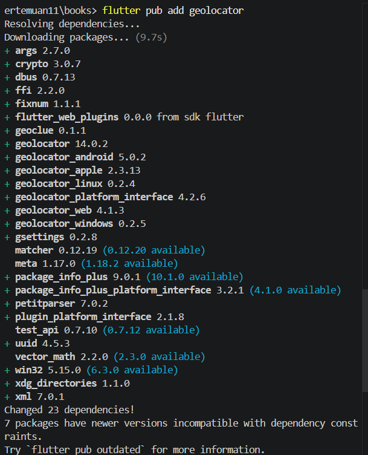

## Langkah 2: Tambah permission GPS

android/app/src/main/androidmanifest.xml

```dart
<uses-permission android:name="android.permission.ACCESS_FINE_LOCATION"/>
    <uses-permission android:name="android.permission.ACCESS_COARSE_LOCATION"/>
```

## Langkah 3: Buat file geolocation.dart

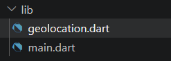

## Langkah 4: Buat StatefulWidget

Buat class LocationScreen di dalam file geolocation.dart

```dart
import 'package:flutter/material.dart';

class LocationScreen extends StatefulWidget {
```

## Langkah 5: Isi kode geolocation.dart

```dart
import 'package:flutter/material.dart';
import 'package:geolocator/geolocator.dart';

class LocationScreen extends StatefulWidget {
  const LocationScreen({super.key});

  @override
  State<LocationScreen> createState() => _LocationScreenState();
}

class _LocationScreenState extends State<LocationScreen> {
  String myPosition = '';

  @override
  void initState() {
    super.initState();

    getPosition().then((Position myPos) {
      myPosition =
          'Latitude: ${myPos.latitude} - Longitude: ${myPos.longitude}';

      setState(() {
        myPosition = myPosition;
      });
    });
  }

  @override
  Widget build(BuildContext context) {
    return Scaffold(
      appBar: AppBar(
        title: const Text('Current Location'),
      ),
      body: Center(
        child: Text(myPosition),
      ),
    );
  }

  Future<Position> getPosition() async {
    await Geolocator.requestPermission();
    await Geolocator.isLocationServiceEnabled();

    Position position = await Geolocator.getCurrentPosition();

    return position;
  }
}
```

### Soal 11

Tambahkan nama panggilan Anda pada tiap properti title sebagai identitas pekerjaan Anda.

```dart
      appBar: AppBar(title: const Text('Current Location - Triska')),

```

## Langkah 6: Edit main.dart

Panggil screen baru tersebut di file main

```dart
import 'dart:async';
import 'package:flutter/material.dart';
import 'package:http/http.dart';
import 'package:http/http.dart' as http;
import 'geolocation.dart';

void main() {
  runApp(const MyApp());
}

class MyApp extends StatelessWidget {
  const MyApp({super.key});

  @override
  Widget build(BuildContext context) {
    return MaterialApp(
      title: 'Future Demo - Triska',
      theme: ThemeData(
        primarySwatch: Colors.blue,
        visualDensity: VisualDensity.adaptivePlatformDensity,
      ),
      home: const LocationScreen(),
    );
  }
}
...

```

## Langkah 7: Run

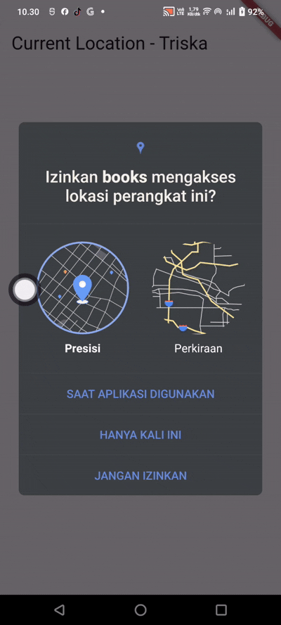

## Langkah 8: Tambahkan animasi loading

```dart
@override
  Widget build(BuildContext context) {
    final myWidget = myPosition == ''
        ? const CircularProgressIndicator()
        : Text(myPosition);

    return Scaffold(
      appBar: AppBar(title: const Text('Current Location - Triska')),
      body: Center(child: myWidget),
    );
  }
```

### Soal 12

- Tambahkan delay pada method getPosition() dengan kode await Future.delayed(const Duration(seconds: 3));

#### lib/geolocation.dart

```dart
Future<Position> getPosition() async {
  await Geolocator.requestPermission();
  await Geolocator.isLocationServiceEnabled();

  await Future.delayed(const Duration(seconds: 3));

  Position position =
      await Geolocator.getCurrentPosition();

  return position;
}
```

- Apakah Anda mendapatkan koordinat GPS ketika run di browser? Mengapa demikian?

#### jawab:

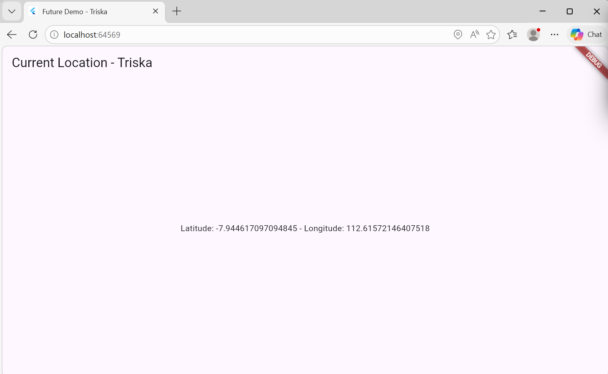

Ya, berhasil mendapatkan koordinat GPS saat menjalankan aplikasi di browser. Hal ini karena browser yang digunakan mendukung fitur geolocation dan telah diberikan izin untuk mengakses lokasi perangkat. Browser kemudian memanfaatkan layanan lokasi yang tersedia, seperti GPS, WiFi, atau jaringan internet, untuk menentukan posisi pengguna dan mengembalikan nilai latitude serta longitude ke aplikasi.

- Capture hasil praktikum Anda berupa GIF
  

# Praktikum 7: Manajemen Future dengan FutureBuilder

## Langkah 1: Modifikasi method getPosition()

Buka file geolocation.dart kemudian ganti isi method dengan kode ini.

```dart
Future<Position> getPosition() async {
    await Geolocator.requestPermission();

    await Geolocator.isLocationServiceEnabled();

    await Future.delayed(const Duration(seconds: 3));

    Position position = await Geolocator.getCurrentPosition();

    return position;
  }
```

## Langkah 2: Tambah variabel

Tambah variabel ini di class \_LocationScreenState

```dart
class _LocationScreenState extends State<LocationScreen> {
  Future<Position>? position;

}
```

## Langkah 3: Tambah initState()

Tambah method ini dan set variabel position

```dart
@override
void initState() {
  super.initState();
  position = getPosition();
}
```

## Langkah 4: Edit method build()

Ketik kode berikut dan sesuaikan. Kode lama bisa dihapus.

```dart
@override
Widget build(BuildContext context) {
  return Scaffold(
    appBar: AppBar(
      title: const Text('Current Location - Triska'),
    ),
    body: Center(
      child: FutureBuilder<Position>(
        future: position,
        builder: (
          BuildContext context,
          AsyncSnapshot<Position> snapshot,
        ) {
          if (snapshot.connectionState ==
              ConnectionState.waiting) {
            return const CircularProgressIndicator();
          } else if (snapshot.connectionState ==
              ConnectionState.done) {
            return Text(snapshot.data.toString());
          } else {
            return const Text('');
          }
        },
      ),
    ),
  );
}
```

### Soal 13

- Apakah ada perbedaan UI dengan praktikum sebelumnya? Mengapa demikian?

#### jawab:

Tidak ada perbedaan UI yang terlihat dibandingkan praktikum sebelumnya. Aplikasi tetap menampilkan loading lalu menampilkan koordinat lokasi. Perbedaannya ada pada kode, yaitu sekarang menggunakan FutureBuilder yang lebih efisien karena dapat memperbarui UI secara otomatis tanpa setState().

- Capture hasil praktikum Anda berupa GIF


- Seperti yang Anda lihat, menggunakan FutureBuilder lebih efisien, clean, dan reactive dengan Future bersama UI.

## Langkah 5: Tambah handling error

Tambahkan kode berikut untuk menangani ketika terjadi error. Kemudian hot restart.

```dart
else if (snapshot.connectionState == ConnectionState.done) {
  if (snapshot.hasError) {
     return Text('Something terrible happened!');
  }
  return Text(snapshot.data.toString());
}
```

### Soal 14

- Apakah ada perbedaan UI dengan langkah .

#### jawab:

Tidak ada perbedaan UI yang terlihat saat aplikasi berjalan normal karena koordinat lokasi tetap ditampilkan seperti sebelumnya. Perbedaannya adalah aplikasi sekarang dapat menangani error dengan lebih baik. Jika terjadi kesalahan saat mengambil lokasi, aplikasi akan menampilkan pesan "Something terrible happened!" sehingga pengguna mengetahui bahwa telah terjadi error dan aplikasi tidak langsung mengalami crash.

- Capture hasil praktikum Anda berupa GIF


# Praktikum 8: Navigation route dengan Future Function

## Langkah 1: Buat file baru navigation_first.dart

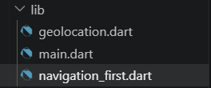

## Langkah 2: Isi kode navigation_first.dart

```dart
import 'package:flutter/material.dart';

class NavigationFirst extends StatefulWidget {
  const NavigationFirst({super.key});

  @override
  State<NavigationFirst> createState() => _NavigationFirstState();
}

class _NavigationFirstState extends State<NavigationFirst> {
  Color color = Colors.blue.shade700;

  @override
  Widget build(BuildContext context) {
    return Scaffold(
      backgroundColor: color,
      appBar: AppBar(
        title: const Text('Navigation First Screen'),
      ),
      body: Center(
        child: ElevatedButton(
          child: const Text('Change Color'),
          onPressed: () {
            _navigateAndGetColor(context);
          },
        ),
      ),
    );
  }
}
```

### Soal 15

- Tambahkan nama panggilan Anda pada tiap properti title sebagai identitas pekerjaan Anda.

```dart
appBar: AppBar(
        title: const Text('Navigation First Screen p Triska'),
      ),
```

- Silakan ganti dengan warna tema favorit Anda.

## Langkah 3: Tambah method di class \_NavigationFirstState

```dart
Future<void> _navigateAndGetColor(BuildContext context) async {
  color = await Navigator.push(
        context,
        MaterialPageRoute(
          builder: (context) => const NavigationSecond(),
        ),
      ) ??
      Colors.blue;

  setState(() {});
}
```

## Langkah 4: Buat file baru navigation_second.dart

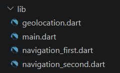

## Langkah 5: Buat class NavigationSecond dengan StatefulWidget

```dart
import 'package:flutter/material.dart';

class NavigationSecond extends StatefulWidget {
  const NavigationSecond({super.key});

  @override
  State<NavigationSecond> createState() => _NavigationSecondState();
}

class _NavigationSecondState extends State<NavigationSecond> {
  @override
  Widget build(BuildContext context) {
    Color color;

    return Scaffold(
      appBar: AppBar(
        title: const Text('Navigation Second Screen - Triska'),
      ),
      body: Center(
        child: Column(
          mainAxisAlignment: MainAxisAlignment.spaceEvenly,
          children: [
            ElevatedButton(
              child: const Text('Red'),
              onPressed: () {
                color = Colors.red.shade700;
                Navigator.pop(context, color);
              },
            ),

            ElevatedButton(
              child: const Text('Green'),
              onPressed: () {
                color = Colors.green.shade700;
                Navigator.pop(context, color);
              },
            ),

            ElevatedButton(
              child: const Text('Blue'),
              onPressed: () {
                color = Colors.blue.shade700;
                Navigator.pop(context, color);
              },
            ),
          ],
        ),
      ),
    );
  }
}
```

## Langkah 6: Edit main.dart

Sesuaikan import dan lakukan edit properti home.

```dart
home: const NavigationFirst()
```

## Langkah 8: Run


### Soal 16

- Cobalah klik setiap button, apa yang terjadi ? Mengapa demikian ?

#### jawab:

Saat setiap tombol (Red, Green, dan Blue) diklik, aplikasi akan kembali ke halaman pertama (Navigation First) dan warna latar belakang halaman tersebut berubah sesuai dengan warna yang dipilih. Hal ini terjadi karena tombol menjalankan Navigator.pop(context, color) yang mengirimkan nilai warna ke halaman sebelumnya. Warna yang diterima kemudian disimpan ke variabel color pada halaman pertama dan tampilan diperbarui menggunakan setState(), sehingga background berubah sesuai pilihan pengguna.

- Gantilah 3 warna pada langkah 5 dengan warna favorit Anda!

```dart
ElevatedButton(
  child: const Text('Purple'),
  onPressed: () {
    color = Colors.deepPurple;
    Navigator.pop(context, color);
  },
),

ElevatedButton(
  child: const Text('Pink'),
  onPressed: () {
    color = Colors.pink;
    Navigator.pop(context, color);
  },
),

ElevatedButton(
  child: const Text('Teal'),
  onPressed: () {
    color = Colors.teal;
    Navigator.pop(context, color);
  },
),
```

- Capture hasil praktikum Anda berupa GIF

  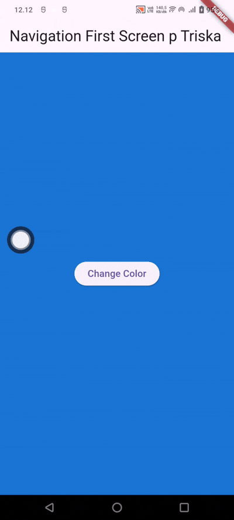

# Praktikum 9: Memanfaatkan async/await dengan Widget Dialog

## Langkah 1: Buat file baru navigation_dialog.dart

## Langkah 2: Isi kode navigation_dialog.dart

```dart
import 'package:flutter/material.dart';

class NavigationDialogScreen extends StatefulWidget {
  const NavigationDialogScreen({super.key});

  @override
  State<NavigationDialogScreen> createState() =>
      _NavigationDialogScreenState();
}

class _NavigationDialogScreenState
    extends State<NavigationDialogScreen> {

  Color color = Colors.deepPurple;

  @override
  Widget build(BuildContext context) {
    return Scaffold(
      backgroundColor: color,
      appBar: AppBar(
        title: const Text(
          'Navigation Dialog Screen - Triska',
        ),
      ),
      body: Center(
        child: ElevatedButton(
          child: const Text('Change Color'),
          onPressed: () {},
        ),
      ),
    );
  }
}
```

## Langkah 3: Tambah method async

```dart
Future<void> _showColorDialog(BuildContext context) async {
  await showDialog(
    barrierDismissible: false,
    context: context,
    builder: (_) {
      return AlertDialog(
        title: const Text('Very Important Question'),
        content: const Text('Please choose a color'),
        actions: <Widget>[
          TextButton(
            child: const Text('Red'),
            onPressed: () {
              color = Colors.red.shade700;
              Navigator.pop(context, color);
            },
          ),
          TextButton(
            child: const Text('Green'),
            onPressed: () {
              color = Colors.green.shade700;
              Navigator.pop(context, color);
            },
          ),
          TextButton(
            child: const Text('Blue'),
            onPressed: () {
              color = Colors.blue.shade700;
              Navigator.pop(context, color);
            },
          ),
        ],
      );
    },
  );

  setState(() {});
}
```

## Langkah 4: Panggil method di ElevatedButton

```dart
child: ElevatedButton(
          child: const Text('Change Color'),
          onPressed: () {
            _showColorDialog(context);
          },
)
```

## Langkah 5: Edit main.dart

Ubah properti home

```dart
home: const NavigationDialogScreen(),
```

## Langkah 6: Run

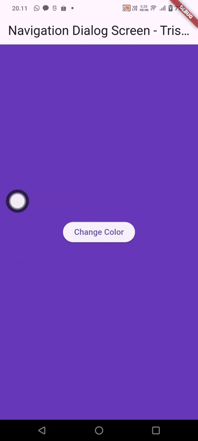

### Soal 17

- Cobalah klik setiap button, apa yang terjadi ? Mengapa demikian ?

#### jawab:

Saat setiap tombol (Red, Green, dan Blue) diklik, dialog akan tertutup dan warna latar belakang halaman akan berubah sesuai dengan warna yang dipilih. Hal ini terjadi karena setiap tombol mengubah nilai variabel color, kemudian memanggil Navigator.pop() untuk menutup dialog. Setelah dialog ditutup, setState() dijalankan sehingga tampilan diperbarui dan warna background berubah sesuai pilihan pengguna.

- Gantilah 3 warna pada langkah 3 dengan warna favorit Anda!

```dart
actions: <Widget>[
            TextButton(
              child: const Text('Brown'),
              onPressed: () {
                color = Colors.brown;
                Navigator.pop(context, color);
              },
            ),
            TextButton(
              child: const Text('Pink'),
              onPressed: () {
                color = Colors.pink;
                Navigator.pop(context, color);
              },
            ),
            TextButton(
              child: const Text('Teal'),
              onPressed: () {
                color = Colors.teal;
                Navigator.pop(context, color);
              },
            ),
          ],
```

- Capture hasil praktikum Anda berupa GIF

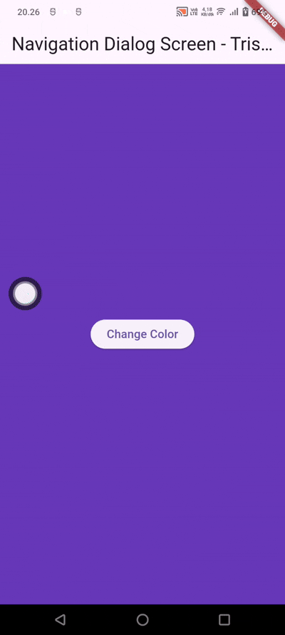
