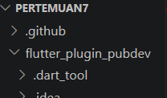
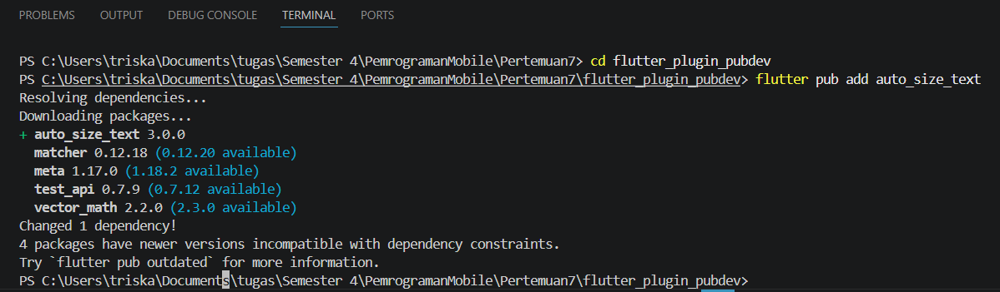
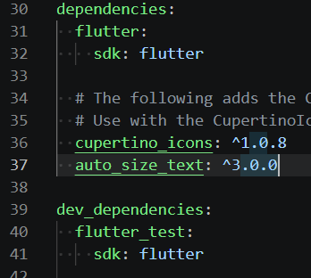
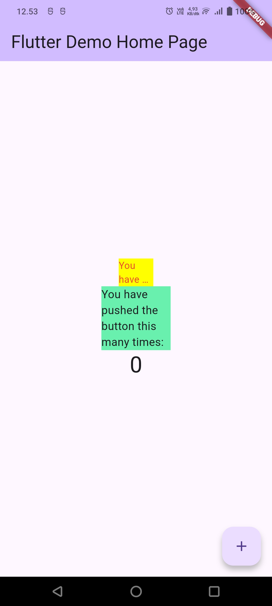

# Laporan Praktikum 07: Manajemen Plugin

Nama: Triskalimatu Sya'adah

NIM: 244107060025

Kelas: SIB 2D

# Praktikum Menerapkan Plugin di Project Flutter

## Langkah 1: Buat Project Baru

Buat sebuah project flutter baru dengan nama flutter_plugin_pubdev.



## Langkah 2: Menambahkan Plugin

Tambahkan plugin auto_size_text menggunakan perintah berikut di terminal





## Langkah 3: Buat file red_text_widget.dart

Buat file baru bernama red_text_widget.dart di dalam folder lib lalu isi kode seperti berikut.

```dart
import 'package:flutter/material.dart';

class RedTextWidget extends StatelessWidget {
  const RedTextWidget({Key? key}) : super(key: key);

  @override
  Widget build(BuildContext context) {
    return Container();
  }
}
```

## Langkah 4: Tambah Widget AutoSizeText

Masih di file red_text_widget.dart, untuk menggunakan plugin auto_size_text, ubahlah kode return Container() menjadi seperti berikut.

```dart
import 'package:flutter/material.dart';

class RedTextWidget extends StatelessWidget {
  const RedTextWidget({Key? key}) : super(key: key);

  @override
  Widget build(BuildContext context) {
    return AutoSizeText(
      text,
      style: const TextStyle(color: Colors.red, fontSize: 14),
      maxLines: 2,
      overflow: TextOverflow.ellipsis,
    );
  }
}
```

Pada kode ini error terjadi karena:

1. Tidak melakukan import package auto_size_text, sehingga widget auto_size_text tidak dikenali

```dart
import 'package:auto_size_text/auto_size_text.dart';
```

2. Variabel text belum dideklarasikan sebagai properti dan belum diberikan melalui constructor. Sehingga widget tidak mengenali dari mana nilai text berasal, akibatnya terjadi error karena variabel tersebut digunakan tanpa didefinisikan di dalam class.

## Langkah 5: Buat Variabel text dan parameter di constructor

Tambahkan variabel text dan parameter di constructor seperti berikut.

```dart
class RedTextWidget extends StatelessWidget {
  final String text;
  const RedTextWidget({Key? key, required this.text}) : super(key: key);
```

## Langkah 6: Tambahkan widget di main.dart

Buka file main.dart lalu tambahkan di dalam children: pada class \_MyHomePageState

```dart
Container(
   color: Colors.yellowAccent,
   width: 50,
   child: const RedTextWidget(
             text: 'You have pushed the button this many times:',
          ),
),
Container(
    color: Colors.greenAccent,
    width: 100,
    child: const Text(
           'You have pushed the button this many times:',
          ),
),
```

Run aplikasi



# Tugas Praktikum

1. Selesaikan Praktikum tersebut, lalu dokumentasikan dan push ke repository Anda berupa screenshot hasil pekerjaan beserta penjelasannya di file README.md!

#### lib/red_text_widget.dart

```dart
import 'package:flutter/material.dart';
import 'package:auto_size_text/auto_size_text.dart';

class RedTextWidget extends StatelessWidget {
  final String text;
  const RedTextWidget({Key? key, required this.text}) : super(key: key);

  @override
  Widget build(BuildContext context) {
    return AutoSizeText(
      text,
      style: const TextStyle(color: Colors.red, fontSize: 14),
      maxLines: 2,
      overflow: TextOverflow.ellipsis,
    );
  }
}
```

#### lib/main.dart

```dart
import 'package:flutter/material.dart';
import 'package:flutter_plugin_pubdev/red_text_widget.dart';

void main() {
  runApp(const MyApp());
}

class MyApp extends StatelessWidget {
  const MyApp({super.key});

  @override
  Widget build(BuildContext context) {
    return MaterialApp(
      title: 'Flutter Plugin Demo',
      theme: ThemeData(primarySwatch: Colors.blue),
      home: const MyHomePage(title: 'Flutter Demo Home Page'),
    );
  }
}

class MyHomePage extends StatefulWidget {
  const MyHomePage({super.key, required this.title});

  final String title;

  @override
  State<MyHomePage> createState() => _MyHomePageState();
}

class _MyHomePageState extends State<MyHomePage> {
  int _counter = 0;

  void _incrementCounter() {
    setState(() {
      _counter++;
    });
  }

  @override
  Widget build(BuildContext context) {
    return Scaffold(
      appBar: AppBar(
        backgroundColor: Theme.of(context).colorScheme.inversePrimary,
        title: Text(widget.title),
      ),
      body: Center(
        child: Column(
          mainAxisAlignment: MainAxisAlignment.center,
          children: <Widget>[
            Container(
              color: Colors.yellowAccent,
              width: 50,
              child: const RedTextWidget(
                text: 'You have pushed the button this many times:',
              ),
            ),
            Container(
              color: Colors.greenAccent,
              width: 100,
              child: const Text('You have pushed the button this many times:'),
            ),
            Text(
              '$_counter',
              style: Theme.of(context).textTheme.headlineMedium,
            ),
          ],
        ),
      ),
      floatingActionButton: FloatingActionButton(
        onPressed: _incrementCounter,
        tooltip: 'Increment',
        child: const Icon(Icons.add),
      ),
    );
  }
}
```

2. Jelaskan maksud dari langkah 2 pada praktikum tersebut!

**Jawaban:**
Langkah 2 bertujuan untuk menambahkan plugin eksternal, yaitu auto_size_text ke dalam project Flutter. Pluggin tersebut digunakan untuk membuat teks menyesuaikan ukuran secara otomatis sesuai dengan ruang yang tersedia.

3. Jelaskan maksud dari langkah 5 pada praktikum tersebut!

```dart
final String text;
const RedTextWidget({Key? key, required this.text}) : super(key: key);
```

**Jawaban:**
Baris final String text; digunakan untuk mendeklarasikan variabel text sebagai properti class yang menyimpan data teks dan tidak dapat diubah (final).

Constructor const RedTextWidget({Key? key, required this.text}) : super(key: key); digunakan untuk menerima nilai text dari luar. Keyword required menandakan bahwa parameter wajib diisi, sedangkan super(key: key) meneruskan key ke parent class.

4. Pada langkah 6 terdapat dua widget yang ditambahkan, jelaskan fungsi dan perbedaannya!

```dart
Container(
   color: Colors.yellowAccent,
   width: 50,
   child: const RedTextWidget(
             text: 'You have pushed the button this many times:',
          ),
),
Container(
    color: Colors.greenAccent,
    width: 100,
    child: const Text(
           'You have pushed the button this many times:',
          ),
),
```

**Jawaban:**
Kode pada langkah 6 digunakan untuk membandingkan perilaku teks antara AutoSizeText dan Text biasa dalam kondisi ruang atau lebar yang berbeda. Perbedaan utama terletak pada kemampuan penyesuaian ukuran teks, di mana AutoSizeText bersifat responsif terhadap ukuran container, sedangkan Text biasa tidak.

5. Jelaskan maksud dari tiap parameter yang ada di dalam plugin auto_size_text berdasarkan tautan pada dokumentasi ini !

**Jawaban:**

- **text**: Parameter utama yang berisi isi teks yang akan ditampilkan, dan ukurannya akan menyesuaikan secara otomatis dengan ruang yang tersedia.

- **style**: Digunakan untuk mengatur tampilan teks, seperti warna, ukuran huruf, jenis font, dan properti visual lainnya.

- **maxLines**: Menentukan jumlah maksimum baris yang dapat ditampilkan. Jika teks melebihi batas ini, maka akan dipotong atau ditampilkan dengan tanda elipsis (...).

- **minFontSize**: Menentukan batas ukuran font terkecil yang boleh digunakan ketika teks diperkecil agar tetap muat dalam container.

- **maxFontSize**: Menentukan batas ukuran font terbesar yang dapat digunakan, sehingga ukuran teks tetap terkontrol.

- **stepGranularity**: Mengatur besar perubahan ukuran font setiap proses penyesuaian. Nilai yang lebih kecil menghasilkan perubahan yang lebih halus, namun membutuhkan proses perhitungan lebih banyak.

- **presetFontSizes**: Berisi daftar ukuran font yang sudah ditentukan sebelumnya, sehingga widget akan memilih ukuran yang paling sesuai dari daftar tersebut tanpa menghitung secara bertahap.

- **group**: Digunakan untuk menghubungkan beberapa widget AutoSizeText agar memiliki ukuran font yang seragam, sehingga tampilan lebih konsisten.

- **textAlign**: Mengatur posisi atau perataan teks, seperti rata kiri, tengah, kanan, atau justify.

- **textDirection**: Menentukan arah penulisan teks, apakah dari kiri ke kanan (LTR) atau sebaliknya (RTL).

- **overflow**: Mengatur bagaimana teks ditampilkan jika melebihi batas, misalnya dipotong atau ditambahkan tanda titik-titik (...).

- **softWrap**: Menentukan apakah teks boleh berpindah ke baris berikutnya secara otomatis saat tidak cukup ruang.

6. Kumpulkan laporan praktikum Anda berupa link repository GitHub kepada dosen!
