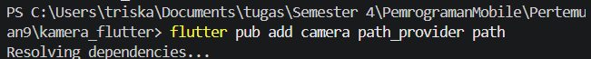
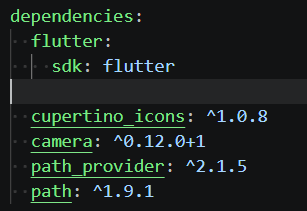
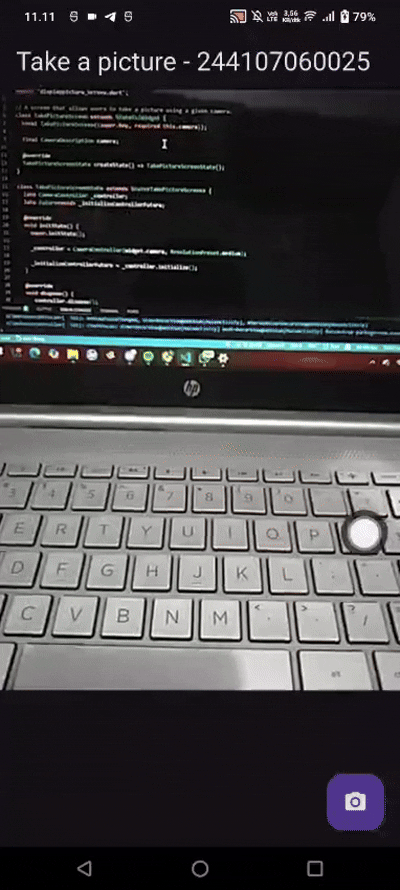
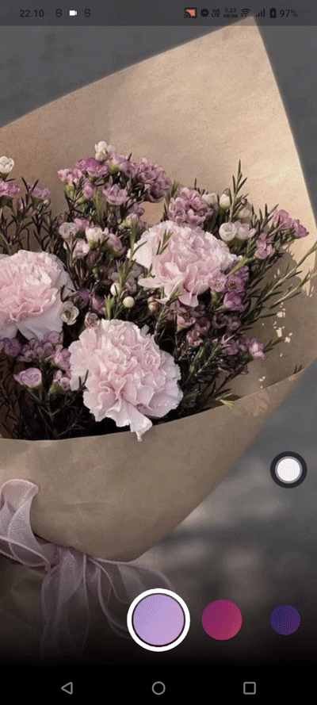
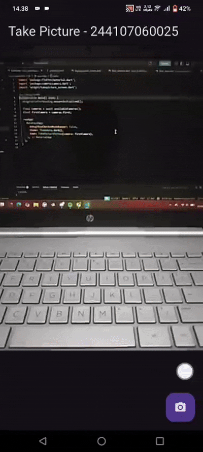

# Laporan Praktikum 09: Kamera

Nama: Triskalimatu Sya'adah

NIM: 244107060025

Kelas: SIB 2D

# Praktikum 1: Mengambil Foto dengan kamera di Flutter

## Langkah 1: Buat Project Baru

Buatlah sebuah project flutter baru dengan nama kamera_flutter, lalu sesuaikan style laporan praktikum yang Anda buat.




## Langkah 2: Tambah dependensi yang diperlukan

Diperlukakn tiga dependensi pada project flutter pada project ini

- camera → menyediakan seperangkat alat untuk bekerja dengan kamera pada device.
- path_provider → menyediakan lokasi atau path untuk menyimpan hasil foto.
- path → membuat path untuk mendukung berbagai platform.

Untuk menambahkan dependensi plugin, jalankan perintah flutter pub add seperti berikut di terminal:

## Langkah 3: Ambil Sensor Kamera dari device

Selanjutnya, kita perlu mengecek jumlah kamera yang tersedia pada perangkat menggunakan plugin camera seperti pada kode berikut ini. Kode ini letakkan dalam void main().

```dart
import 'package:flutter/material.dart';
import 'package:camera/camera.dart';
import 'widget/takepicture_screen.dart';

Future<void> main() async {
  // WAJIB sebelum akses kamera
  WidgetsFlutterBinding.ensureInitialized();

  // Ambil semua kamera di device
  final cameras = await availableCameras();

  // Ambil kamera pertama (biasanya belakang)
  final firstCamera = cameras.first;

  runApp(
    MaterialApp(
      debugShowCheckedModeBanner: false,
      home: TakePictureScreen(camera: firstCamera),
    ),
  );
}
```

## Langkah 4: Buat dan inisialisasi CameraController

Pada langkah berikut ini, akan membuat koneksi ke kamera perangkat yang memungkinkan untuk mengontrol kamera dan menampilkan pratinjau umpan kamera.

1. Buat StatefulWidget dengan kelas State pendamping.
2. Tambahkan variabel ke kelas State untuk menyimpan CameraController.
3. Tambahkan variabel ke kelas State untuk menyimpan Future yang dikembalikan dari CameraController.initialize().
4. Buat dan inisialisasi controller dalam metode initState().
5. Hapus controller dalam metode dispose().

#### lib/widget/takepicture_screen.dart

```dart
import 'package:camera/camera.dart';
import 'package:flutter/material.dart';

// A screen that allows users to take a picture using a given camera.
class TakePictureScreen extends StatefulWidget {
  const TakePictureScreen({
    super.key,
    required this.camera,
  });

  final CameraDescription camera;

  @override
  TakePictureScreenState createState() => TakePictureScreenState();
}

class TakePictureScreenState extends State<TakePictureScreen> {
  late CameraController _controller;
  late Future<void> _initializeControllerFuture;

  @override
  void initState() {
    super.initState();

    // Membuat controller kamera
    _controller = CameraController(
      widget.camera,
      ResolutionPreset.medium,
    );

    // Inisialisasi kamera (async)
    _initializeControllerFuture = _controller.initialize();
  }

  @override
  void dispose() {
    // Wajib dispose controller
    _controller.dispose();
    super.dispose();
  }

  @override
  Widget build(BuildContext context) {
    // Fill this out in the next steps.
    return Container();
  }
}
```

## Langkah 5: Gunakan CameraPreview untuk menampilkan preview foto

Gunakan widget CameraPreview dari package camera untuk menampilkan preview foto. Perlu tipe objek void berupa FutureBuilder untuk menangani proses async.

#### lib/widget/takepicture_screen.dart

```dart
@override
  Widget build(BuildContext context) {
    return Scaffold(
      appBar: AppBar(
        title: const Text('Take a picture - NIM Anda'),
      ),

      body: FutureBuilder<void>(
        future: _initializeControllerFuture,
        builder: (context, snapshot) {
          if (snapshot.connectionState == ConnectionState.done) {
            // Kamera sudah siap → tampilkan preview
            return CameraPreview(_controller);
          } else {
            // Masih loading
            return const Center(
              child: CircularProgressIndicator(),
            );
          }
        },
      ),
    );
```

## Langkah 6: Ambil foto dengan CameraController

Pada tahap ini, CameraController digunakan untuk mengambil gambar melalui metode takePicture() yang menghasilkan objek XFile berisi lokasi file foto pada cache perangkat. Pengambilan foto dilakukan dengan FloatingActionButton, setelah memastikan kamera sudah terinisialisasi. Proses ini dibungkus dalam try-catch untuk menangani kemungkinan error saat pengambilan gambar.

#### lib/widget/takepicture_screen.dart

```dart
floatingActionButton: FloatingActionButton(
        onPressed: () async {
          try {
            // Pastikan kamera sudah siap
            await _initializeControllerFuture;

            // Ambil foto
            final image = await _controller.takePicture();

            // Debug path foto
          } catch (e) {
            // If an error occurs, log the error to the console
            print(e);
          }
        },
        child: const Icon(Icons.camera_alt),
      ),
```

## Langkah 7: Buat widget baru DisplayPictureScreen

Buatlah file baru pada folder widget yang berisi kode berikut

#### lib/widget/displaypicture_screen.dart

```dart
runApp(
    MaterialApp(
      theme: ThemeData.dark(),
      home: TakePictureScreen(
        // Pass the appropriate camera to the TakePictureScreen widget.
        camera: firstCamera,
      ),
      debugShowCheckedModeBanner: false,
    ),
  );
```

## Langkah 9: Menampilkan hasil foto

#### lib/widget/takepicture_screen.dart

```dart
floatingActionButton: FloatingActionButton(
        onPressed: () async {
          try {
            await _initializeControllerFuture;

            final image = await _controller.takePicture();

            if (!context.mounted) return;

            await Navigator.of(context).push(
              MaterialPageRoute(
                builder: (context) =>
                DisplayPictureScreen(
                  imagePath: image.path,
                ),
              ),
            );
          } catch (e) {
            print(e);
          }
        },
        child: const Icon(Icons.camera_alt),
      ),
```

#### hasil deploye pada device



# Praktikum 2: Membuat photo filter carousel

## Langkah 1: Buat project baru

Buatlah project flutter baru di pertemuan 09 dengan nama photo_filter_carousel

## Langkah 2: Buat widget Selector ring dan dark gradient

Buatlah folder widget dan file baru yang berisi kode berikut.

#### lib/widget/filter_selector.dart

```dart
import 'package:flutter/material.dart';
import 'package:flutter/rendering.dart';
import 'carousel_flowdelegate.dart';
import 'filter_item.dart';

@immutable
class FilterSelector extends StatefulWidget {
  const FilterSelector({
    super.key,
    required this.filters,
    required this.onFilterChanged,
    this.padding = const EdgeInsets.symmetric(vertical: 24),
  });

  final List<Color> filters;
  final void Function(Color selectedColor) onFilterChanged;
  final EdgeInsets padding;

  @override
  State<FilterSelector> createState() => _FilterSelectorState();
}

class _FilterSelectorState extends State<FilterSelector> {
  static const _filtersPerScreen = 5;
  static const _viewportFractionPerItem = 1.0 / _filtersPerScreen;

  late final PageController _controller;
  late int _page;

  int get filterCount => widget.filters.length;

  Color itemColor(int index) => widget.filters[index % filterCount];

  @override
  void initState() {
    super.initState();
    _page = 0;
    _controller = PageController(
      initialPage: _page,
      viewportFraction: _viewportFractionPerItem,
    );
    _controller.addListener(_onPageChanged);
  }

  void _onPageChanged() {
    final page = (_controller.page ?? 0).round();
    if (page != _page) {
      _page = page;
      widget.onFilterChanged(widget.filters[page]);
    }
  }

  void _onFilterTapped(int index) {
    _controller.animateToPage(
      index,
      duration: const Duration(milliseconds: 450),
      curve: Curves.ease,
    );
  }

  @override
  void dispose() {
    _controller.dispose();
    super.dispose();
  }

  @override
  Widget build(BuildContext context) {
    return Scrollable(
      controller: _controller,
      axisDirection: AxisDirection.right,
      physics: const PageScrollPhysics(),
      viewportBuilder: (context, viewportOffset) {
        return LayoutBuilder(
          builder: (context, constraints) {
            final itemSize = constraints.maxWidth * _viewportFractionPerItem;

            viewportOffset
              ..applyViewportDimension(constraints.maxWidth)
              ..applyContentDimensions(0.0, itemSize * (filterCount - 1));

            return Stack(
              alignment: Alignment.bottomCenter,
              children: [
                _buildShadowGradient(itemSize),
                _buildCarousel(
                  viewportOffset: viewportOffset,
                  itemSize: itemSize,
                ),
                _buildSelectionRing(itemSize),
              ],
            );
          },
        );
      },
    );
  }

  Widget _buildShadowGradient(double itemSize) {
    return SizedBox(
      height: itemSize * 2 + widget.padding.vertical,
      child: const DecoratedBox(
        decoration: BoxDecoration(
          gradient: LinearGradient(
            begin: Alignment.topCenter,
            end: Alignment.bottomCenter,
            colors: [Colors.transparent, Colors.black],
          ),
        ),
        child: SizedBox.expand(),
      ),
    );
  }

  Widget _buildCarousel({
    required ViewportOffset viewportOffset,
    required double itemSize,
  }) {
    return Container(
      height: itemSize,
      margin: widget.padding,
      child: Flow(
        delegate: CarouselFlowDelegate(
          viewportOffset: viewportOffset,
          filtersPerScreen: _filtersPerScreen,
        ),
        children: [
          for (int i = 0; i < filterCount; i++)
            FilterItem(
              onFilterSelected: () => _onFilterTapped(i),
              color: itemColor(i),
            ),
        ],
      ),
    );
  }

  Widget _buildSelectionRing(double itemSize) {
    return IgnorePointer(
      child: Padding(
        padding: widget.padding,
        child: SizedBox(
          width: itemSize,
          height: itemSize,
          child: const DecoratedBox(
            decoration: BoxDecoration(
              shape: BoxShape.circle,
              border: Border.fromBorderSide(
                BorderSide(width: 6, color: Colors.white),
              ),
            ),
          ),
        ),
      ),
    );
  }
}
```

# Langkah 3: Buat widget photo filter carousel

#### lib/widget/filter_carousel.dart

```dart
import 'package:flutter/material.dart';
import 'filter_selector.dart';

@immutable
class PhotoFilterCarousel extends StatefulWidget {
  const PhotoFilterCarousel({super.key});

  @override
  State<PhotoFilterCarousel> createState() => _PhotoFilterCarouselState();
}

class _PhotoFilterCarouselState extends State<PhotoFilterCarousel> {
  final _filters = [
    Colors.white,
    ...List.generate(
      Colors.primaries.length,
      (index) => Colors.primaries[(index * 4) % Colors.primaries.length],
    ),
  ];

  final _filterColor = ValueNotifier<Color>(Colors.white);

  void _onFilterChanged(Color value) {
    _filterColor.value = value;
  }

  @override
  Widget build(BuildContext context) {
    return Material(
      color: Colors.black,
      child: Stack(
        children: [
          Positioned.fill(child: _buildPhotoWithFilter()),
          Positioned(
            left: 0.0,
            right: 0.0,
            bottom: 0.0,
            child: _buildFilterSelector(),
          ),
        ],
      ),
    );
  }

  Widget _buildPhotoWithFilter() {
    return ValueListenableBuilder(
      valueListenable: _filterColor,
      builder: (context, color, child) {
        // Anda bisa ganti dengan foto Anda sendiri
        return Image.network(
          'https://i.pinimg.com/736x/1e/0c/32/1e0c32423c5d20880b08d372935b6440.jpg',
          color: color.withValues(alpha: 0.5),
          colorBlendMode: BlendMode.color,
          fit: BoxFit.cover,
        );
      },
    );
  }

  Widget _buildFilterSelector() {
    return FilterSelector(onFilterChanged: _onFilterChanged, filters: _filters);
  }
}
```

# Langkah 4: Membuat filter warna - bagian 1

#### lib/widget/carousel_flowdelegate.dart

```dart
import 'dart:math' as math;
import 'package:flutter/rendering.dart';

class CarouselFlowDelegate extends FlowDelegate {
  CarouselFlowDelegate({
    required this.viewportOffset,
    required this.filtersPerScreen,
  }) : super(repaint: viewportOffset);

  final ViewportOffset viewportOffset;
  final int filtersPerScreen;

  @override
  void paintChildren(FlowPaintingContext context) {
    final count = context.childCount;

    final size = context.size.width;
    final itemExtent = size / filtersPerScreen;

    final active = viewportOffset.pixels / itemExtent;

    final min = math.max(0, active.floor() - 3).toInt();
    final max = math.min(count - 1, active.ceil() + 3).toInt();

    for (var index = min; index <= max; index++) {
      final itemXFromCenter = itemExtent * index - viewportOffset.pixels;

      final percentFromCenter = 1.0 - (itemXFromCenter / (size / 2)).abs();

      final itemScale = 0.5 + (percentFromCenter * 0.5);
      final opacity = 0.25 + (percentFromCenter * 0.75);

      final itemTransform = Matrix4.identity()
        ..translateByDouble((size - itemExtent) / 2, 0, 0, 1)
        ..translateByDouble(itemXFromCenter, 0, 0, 1)
        ..translateByDouble(itemExtent / 2, itemExtent / 2, 0, 1)
        ..multiply(Matrix4.diagonal3Values(itemScale, itemScale, 1.0))
        ..translateByDouble(-itemExtent / 2, -itemExtent / 2, 0, 1);
      context.paintChild(index, transform: itemTransform, opacity: opacity);
    }
  }

  @override
  bool shouldRepaint(covariant CarouselFlowDelegate oldDelegate) {
    return oldDelegate.viewportOffset != viewportOffset;
  }
}
```

# Langkah 5: Membuat filter warna

#### lib/widget/filter_item.dart

```dart
import 'package:flutter/material.dart';

@immutable
class FilterItem extends StatelessWidget {
  const FilterItem({super.key, required this.color, this.onFilterSelected});

  final Color color;
  final VoidCallback? onFilterSelected;

  @override
  Widget build(BuildContext context) {
    return GestureDetector(
      onTap: onFilterSelected,
      child: AspectRatio(
        aspectRatio: 1.0,
        child: Padding(
          padding: const EdgeInsets.all(8),
          child: ClipOval(
            child: Image.network(
              'https://images.unsplash.com/photo-1557682250-33bd709cbe85?w=200&h=200&fit=crop',
              color: color.withValues(alpha: 0.5),
              colorBlendMode: BlendMode.hardLight,
              loadingBuilder: (context, child, loadingProgress) {
                if (loadingProgress == null) return child;
                return Container(
                  color: Colors.grey[800],
                  child: const Center(
                    child: CircularProgressIndicator(
                      strokeWidth: 2,
                      color: Colors.white,
                    ),
                  ),
                );
              },
              errorBuilder: (context, error, stackTrace) {
                return Container(
                  color: color.withValues(alpha: 0.3),
                  child: const Icon(
                    Icons.error_outline,
                    color: Colors.white,
                    size: 16,
                  ),
                );
              },
            ),
          ),
        ),
      ),
    );
  }
}
```

# Langkah 6: Implementasi filter carousel

#### lib/main.dart

```dart
import 'package:flutter/material.dart';
import 'widget/filter_carousel.dart';

void main() {
  runApp(
    const MaterialApp(
      home: PhotoFilterCarousel(),
      debugShowCheckedModeBanner: false,
    ),
  );
}
```

#### hasil deploye pada device



# Tugas Praktikum

1. Selesaikan Praktikum 1 dan 2, lalu dokumentasikan dan push ke repository Anda berupa screenshot setiap hasil pekerjaan beserta penjelasannya di file README.md! Jika terdapat error atau kode yang tidak dapat berjalan, silakan Anda perbaiki sesuai tujuan aplikasi dibuat!
2. Gabungkan hasil praktikum 1 dengan hasil praktikum 2 sehingga setelah melakukan pengambilan foto, dapat dibuat filter carouselnya!

#### Hasil



3. Jelaskan maksud void async pada praktikum 1?

#### Jawab:

void async digunakan untuk membuat fungsi asynchronous, yaitu fungsi yang dapat menjalankan proses yang membutuhkan waktu tanpa menghentikan jalannya program. Pada praktikum 1, async dipakai saat menginisialisasi kamera dan mengambil foto karena proses tersebut memerlukan waktu untuk mengakses hardware kamera. Sedangkan void berarti fungsi tersebut tidak mengembalikan nilai.

4. Jelaskan fungsi dari anotasi @immutable dan @override ?

#### Jawab:

- @immutable adalah anotasi yang digunakan untuk menandai bahwa sebuah class memiliki data yang tidak boleh diubah setelah objek dibuat. Artinya, semua variabel di dalam class tersebut bersifat tetap (final). Pada Flutter, anotasi ini sering dipakai pada widget agar tampilan dan data tetap konsisten serta mengurangi kemungkinan terjadinya perubahan data yang tidak disengaja.
- @override digunakan ketika sebuah method dari class induk ingin ditulis ulang pada class turunan agar memiliki fungsi yang sesuai dengan kebutuhan program. Dengan anotasi ini, Flutter mengetahui bahwa method tersebut berasal dari parent class. Contohnya pada method build(), initState(), dan dispose() yang sudah tersedia pada StatefulWidget maupun StatelessWidget, lalu disesuaikan kembali oleh programmer.

5. Kumpulkan link commit repository GitHub Anda kepada dosen yang telah disepakati!
